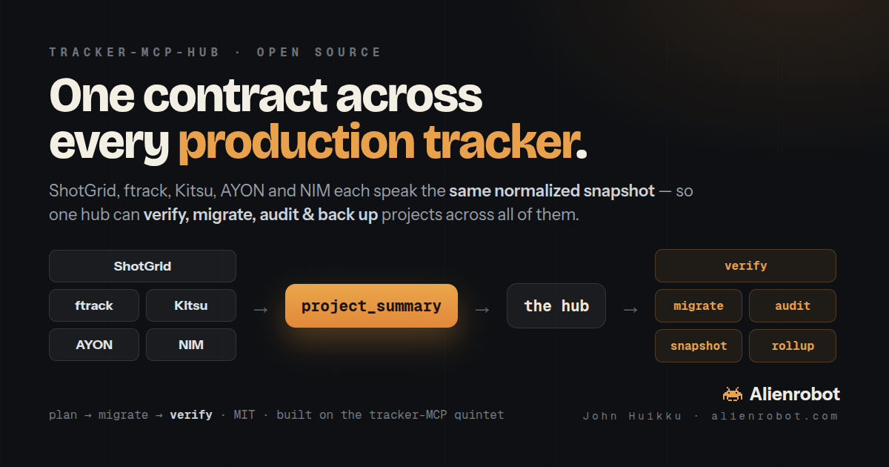

# tracker-mcp-hub



A **tracker-agnostic production-data layer** built on top of the tracker-MCP quartet
([`shotgrid-mcp`](https://github.com/huikku/shotgrid-mcp) · [`ftrack-mcp`](https://github.com/huikku/ftrack-mcp) ·
[`kitsu-mcp`](https://github.com/huikku/kitsu-mcp) · [`ayon-mcp`](https://github.com/huikku/ayon-mcp)).

Each tracker MCP emits the **same normalized snapshot** (`project_summary`). The hub consumes that one
contract to do things no single tracker can: **verify, migrate, audit, snapshot/restore, and roll up** —
across ShotGrid, ftrack, Kitsu and AYON interchangeably.

> The hub is mostly **pure** — `verify` / `audit` / `rollup` / `snapshot` operate only on the normalized
> JSON and need no tracker SDK. Only `migrate` (write) touches the tracker MCPs.

## The capabilities

| Module | What it does | Reads |
|---|---|---|
| **`verify`** | Diff two project snapshots → report (count deltas, missing/extra, casting & per-task status mismatches, coverage) + `match`/`discrepancies` verdict | 2 summaries |
| **`audit`** | Verify one source-of-truth against many mirror copies → drift report (great on a schedule) | N summaries |
| **`rollup`** | Aggregate many projects → totals, status distribution, coverage (a "state of all productions" dashboard) | N summaries |
| **`snapshot`** | Wrap a project into a portable, versioned archive (the normalized model + optional media manifest) | 1 summary |
| **`migrate`** | Orchestrated copy: **read → write → verify**. Ends every run with proof. (Ships the SG→Kitsu reference edge.) | source + target |

The model: **plan → migrate → verify** — preflight (from the tracker MCPs) before, an automatic verify report
after.

## Proven live
Pointed at the *same* project copied to all three of the original trackers, the hub surfaced real drift automatically:

```
AUDIT  shotgrid (source of truth)  vs  2 mirrors
  kitsu  copy:  tasks −53
  ftrack copy:  tasks −8 · 615 status mismatches · 357 casting mismatches
                · assets missing 1 (Farmhouse) / extra 2 (Farmhouse (2), Branch (2))   ← ftrack name-collisions
```
Every one of those is a documented cross-tracker incompatibility — found by diffing snapshots, no manual work.
And an orchestrated `migrate` of a slice ended with **VERIFY: PASS** (all counts matched).

## Architecture

```
shotgrid-mcp ─┐
ftrack-mcp  ──┤
kitsu-mcp   ──┤  project_summary  (one normalized contract)
ayon-mcp     ─┘        │
                       ▼
              tracker-mcp-hub  →  verify · audit · rollup · snapshot · migrate
```

Four standalone, single-purpose tracker MCPs (published & credited) + one hub that turns the uniform
contract into cross-tracker products. Adding a tracker = a new MCP that emits `project_summary`; everything
in the hub works on it for free.

## Status
v0.1 — `verify` / `audit` / `rollup` / `snapshot` complete and live-tested; `migrate` ships the SG→Kitsu
reference edge (other edges = add a `read_`/`write_` per tracker). Media carry (thumbnails/movies) is handled
by the tracker MCPs' media tools; the migrate reference copies structure + statuses + casting and reports any
media-coverage gap. MIT.

## Docs

📊 **[`COMPARISON.md`](COMPARISON.md)** — side-by-side of the four trackers (data model, status vocabularies)
and the **migration incompatibilities** to know about (casting can't round-trip through ftrack; statuses must
be mapped; heavy publish bytes stay on storage).

🧪 **[`TESTING.md`](TESTING.md)** — how the quartet is validated: live round-trip tests, two-level dry-run checks,
and the cross-tracker migration matrix, with what is *not* yet covered stated plainly.

---

Built by **John Huikku** · [alienrobot.com](https://alienrobot.com)
